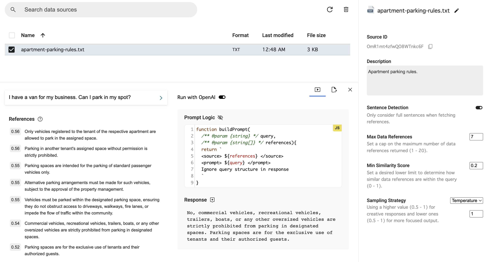

# Get Started

import BrowserWindow from "@site/src/components/BrowserWindow";

Let's publish a Knowledge Agent in minutes!

### What you'll need

- Create an account with [nodb.ai](https://app.nodb.ai).
- Make sure you have a document to run LLM queries against. This could be about anything, e.g board game rules, lease agreements, exam prep notes, etc.

## 1. Upload your document

There are three options to ingest your data in NoDB:

- Upload TXT, PDF
- Add Google Docs
- Write a document in-app

In this quick tutorial, we've uploaded a document that specifies an apartment's parking rules and restrictions.

## 2. Run a query

Once your uploaded document is ready, select it to open up the console and configurations.

Now you're ready to run a query against your data!

Here's what it should looks like:

<BrowserWindow url="https://app.nodb.ai/data-source?ss=OmR1mt4zfwQO8WTnkc6F">

</BrowserWindow>

Notice the configurations on the right side.

- Every data source has a unique ID.
- By default, only key sentences are used when fetching data references.
- References that matched the similary score are added as context to your query.

To learn more about these configs, see [Data Source](/docs/guides/data-source).

:::info

NoDB provides you with **$1** credit for storing your vector embeddings and creating context-aware responses with LLMs. We'll ask for your billing information once you've exceeded your credit. See [Usage](/docs/guides/usage).

:::

## 3. Publish a Knowledge Agent

Ready to share your data source? Publish a Knowledge Agent.
